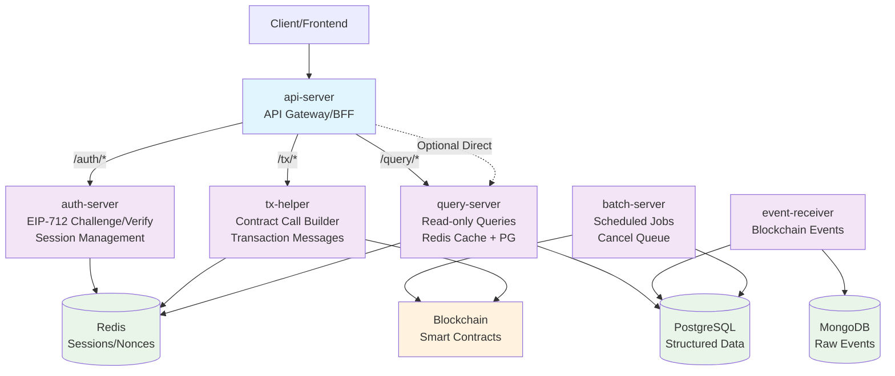
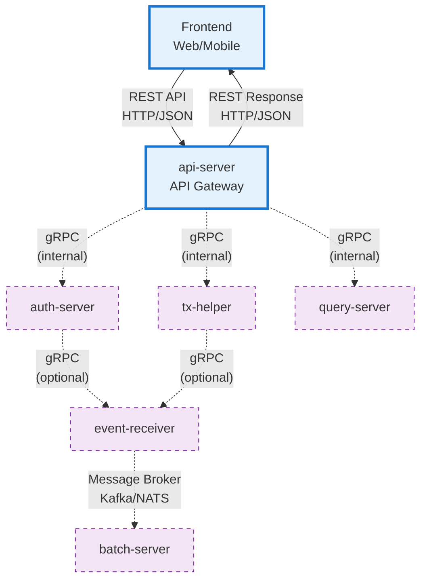

## Backend Architecture

```mermaid
graph TD;
Client[Client/Frontend] --> Gateway[api-server<br/>API Gateway/BFF]

Gateway -->|/auth/*| Auth[auth-server<br/>EIP-712 Challenge/Verify<br/>Session Management]
Gateway -->|/tx/*| TxHelper[tx-helper<br/>Contract Call Builder<br/>Transaction Messages]
Gateway -->|/query/*| Query[query-server<br/>Read-only Queries<br/>Redis Cache + PG]

Auth --> Redis[(Redis<br/>Sessions/Nonces)]
TxHelper --> Redis
Query --> Redis
Query --> PG[(PostgreSQL<br/>Structured Data)]

EventReceiver[event-receiver<br/>Blockchain Events] --> Mongo[(MongoDB<br/>Raw Events)]
EventReceiver --> PG

Batch[batch-server<br/>Scheduled Jobs<br/>Cancel Queue] --> PG
Batch --> Blockchain[Blockchain<br/>Smart Contracts]

TxHelper --> Blockchain

Gateway -.->|Optional Direct| Query

classDef gateway fill:#e1f5fe
classDef service fill:#f3e5f5
classDef database fill:#e8f5e8
classDef blockchain fill:#fff3e0

class Gateway gateway
class Auth,TxHelper,Query,EventReceiver,Batch service
class Redis,PG,Mongo database
class Blockchain blockchain

```
  
  
## API protocols

```mermaid
graph TD
    Frontend[Frontend<br/>Web/Mobile] -->|REST API<br/>HTTP/JSON| Gateway[api-server<br/>API Gateway]
    
    Gateway -.->|"gRPC<br/>(internal)"| Auth[auth-server]
    Gateway -.->|"gRPC<br/>(internal)"| TxHelper[tx-helper]
    Gateway -.->|"gRPC<br/>(internal)"| Query[query-server]
    
    Auth -.->|"gRPC<br/>(optional)"| EventReceiver[event-receiver]
    TxHelper -.->|"gRPC<br/>(optional)"| EventReceiver
    
    EventReceiver -.->|"Message Broker<br/>Kafka/NATS"| Batch[batch-server]
    
    Gateway -->|"REST Response<br/>HTTP/JSON"| Frontend
    
    classDef external fill:#e3f2fd,stroke:#1976d2,stroke-width:3px
    classDef internal fill:#f3e5f5,stroke:#7b1fa2,stroke-dasharray: 5 5
    classDef async fill:#fff3e0,stroke:#f57c00,stroke-dasharray: 3 3
    
    class Frontend,Gateway external
    class Auth,TxHelper,Query,EventReceiver,Batch internal
```
